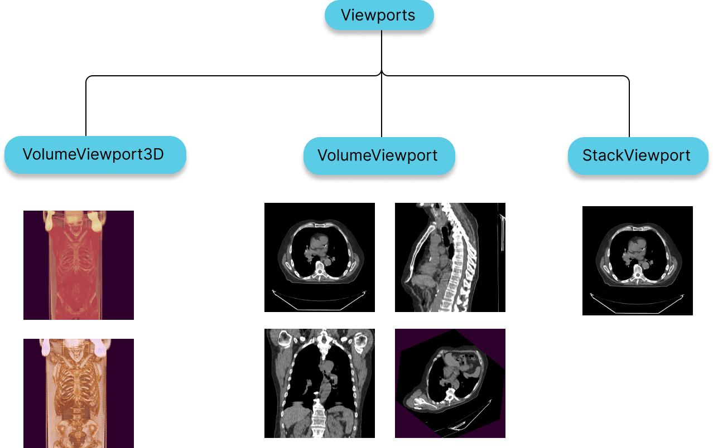

---

id: viewports  
title: 视口  
sidebar_position: 10
---  

# 视口  

视口可以被认为是：  

- 从特定视角查看图像的相机。  
- 显示该相机输出的画布。  
- 从图像数据到可视数据的一组变换（LUT、窗位、平移等）  

在 `Cornerstone3D` 中，视口是从 HTML 元素创建的，使用者应传递要创建视口的 `element`。例如，一个 CT 序列可以通过“4 分屏”视图的 4 个视口来查看：轴向 MPR、矢状 MPR、冠状 MPR、3D 透视体积渲染。  

更多关于选择哪幅图像以及如何展示该图像的参考和展示细节，请参见[视口参考与展示](./viewportReferencePresentation.md)。  

<div style={{textAlign: 'center'}}>



</div>  

## StackViewport  

- 适用于渲染一堆图像，这些图像可能属于同一图像，也可能不属于。  
- 堆栈可以包括各种形状、大小和方向的 2D 图像  

## VolumeViewport  

- 适用于渲染被视为一个 3D 图像的体积数据。  
- 拥有 VolumeViewport 使得多平面重建或重构（MPR）成为设计的一部分，您可以从不同的方向可视化体积，而不会增加性能成本。  
- 用于两系列之间的图像融合  

## 3D Viewport  

- 适用于实际的体积数据 3D 渲染。  
- 用于拥有不同类型的预设，如骨骼、软组织、肺部等。  

:::note  

`StackViewport` 和 `VolumeViewport`，`VolumeViewport3D` 都是通过 `RenderingEngine` API 创建的。  

:::  

## VideoViewport  

- 适用于渲染视频数据  
- 视频可以包括 MPEG 4 编码的视频流。理论上，MPEG2 也支持，但实际上浏览器不支持。  

## Whole Slide Image Viewport  

- 适用于渲染全切片图像  

## Initial Display Area  

所有视口继承自 Viewport 类，该类具有一个可以提供的 `displayArea` 字段。此字段可用于编程方式设置图像的初始缩放/平移。默认情况下，视口会将 DICOM 图像适应屏幕。`displayArea` 接受一个 `DisplayArea` 类型，其具有以下字段。  

```js  
type DisplayArea = {  
  imageArea: [number, number], // areaX, areaY  
  imageCanvasPoint: {  
    imagePoint: [number, number], // imageX, imageY  
    canvasPoint: [number, number], // canvasX, canvasY  
  },  
  storeAsInitialCamera: boolean,  
};  
```  

缩放和平移都是相对于初始的“适应屏幕”视图。  

为了将图像缩放到 200%，我们会将 `imageArea` 设置为 [0.5, 0.5]。  

平移由提供的 `imagePoint` 和提供的 `canvasPoint` 控制。您可以将画布想象为一张白纸，图像想象为另一张像胸部 X 光的纸。用笔在画布纸上标记一个点，然后在您的胸部 X 光图像上标记另一个点。现在尝试“平移”您的图像，使得 `imagePoint` 与 `canvasPoint` 匹配。这就是 `imageCanvasPoint` API 设计所代表的。  

因此，如果您想左对齐您的图像，可以提供以下值：  

```js  
imageCanvasPoint: {  
  imagePoint: [0, 0.5], // imageX, imageY  
  canvasPoint: [0, 0.5], // canvasX, canvasY  
};  
```  

这意味着画布上的左（0）中间（0.5）点需要与图像上的左（0）中间（0.5）点对齐。值基于全图的百分比大小。在此示例中，如果我们有一个 1024 x 1024 的 X 光图像。`imagePoint` 将是 [0, 512]。假设我们在横向模式下使用移动 iPhone（844 x 390）。`canvasPoint` 将是 [0, 195]。  