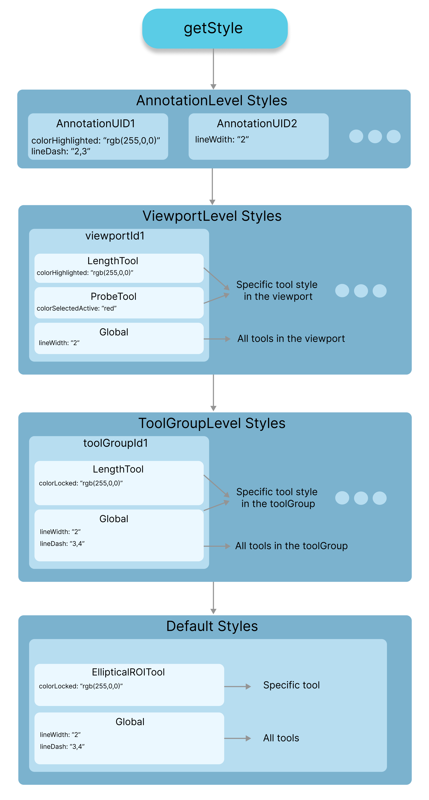

---  
id: config  
title: 配置  
sidebar_position: 6
---  

在本节中，我们将解释更改工具样式的各种方式。这包括各种属性，如 `color`（当 `selected`、`highlighted` 或 `locked` 时）；文本框颜色、线条样式、粗细等。  

## 样式层级  

我们将从样式层级开始看起。样式层级如下所示。  

- 注释级别设置（具有 UID）**set/getAnnotationToolStyle**  
  - 视口级别工具设置 **set/getViewportToolStyle**  
    - 每个工具这一层：该视口上的长度  
    - 全局这一层：该视口中的所有工具  
      - 工具组设置（适用于所有视口中该工具组内的任何工具）**set/getToolGroupToolStyle**  
        - 每个工具这一层：该工具组内所有视口上的角度  
        - 全局这一层：该工具组内所有视口中的所有工具  
          - 默认级别：**set/getDefaultToolStyle**  
            - 每个工具这一层（长度）设置  
            - 全局（应用级别）设置（我们提供了默认设置）。  

在注释渲染循环中，获取某个属性（`color`、`lineDash`、`lineThickness`）的样式时，我们首先检查该样式是否在注释级别设置（优先级最高）。  
如果没有，我们检查视口级别是否设置了样式（注释绘制的视口）；然而，在视口级别，我们首先检查工具级别设置是否已设置。如果没有，我们检查“全局”（视口中所有工具）级别。  
如果没有找到，我们移动到下一级工具组级别。如果仍未找到，我们移至最后一级，即全局级别。  

  

## 默认设置  

`Cornerstone3DTools` 为工具样式类初始化了默认设置，可以在 `packages/tools/src/stateManagement/annotation/config/ToolStyle.ts` 中找到。  

```js  
{  
  color: 'rgb(255, 255, 0)',  
  colorHighlighted: 'rgb(0, 255, 0)',  
  colorSelected: 'rgb(0, 220, 0)',  
  colorLocked: 'rgb(255, 255, 0)',  
  lineWidth: '1',  
  lineDash: '',  
  textBoxVisibility: true,  
  textBoxFontFamily: 'Helvetica Neue, Helvetica, Arial, sans-serif',  
  textBoxFontSize: '14px',  
  textBoxColor: 'rgb(255, 255, 0)',  
  textBoxColorHighlighted: 'rgb(0, 255, 0)',  
  textBoxColorSelected: 'rgb(0, 255, 0)',  
  textBoxColorLocked: 'rgb(255, 255, 0)',  
  textBoxBackground: '',  
  textBoxLinkLineWidth: '1',  
  textBoxLinkLineDash: '2,3',  
};  
```  

但是，你可以调整上述每个参数以及接下来我们将讨论的其他样式。  

## 设置样式  

样式层级的每一层都有一组可以设置的样式。样式如下所示。  

### 注释级别设置  

```js  
import { annotations } from '@cornerstonejs/tools';  

// 注释级别  
const styles = {  
  colorHighlighted: 'rgb(255, 255, 0)',  
};  

annotation.config.style.setAnnotationToolStyle(annotationUID, style);  
```  

### 视口级别工具设置  

```js  
// 视口级别  
const styles = {  
  LengthTool: {  
    colorHighlighted: 'rgb(255, 255, 0)',  
  },  
  global: {  
    lineWidth: '2',  
  },  
};  

annotation.config.style.setViewportToolStyle(viewportId, styles);  
```  

### 工具组级别工具设置  

```js  
const styles = {  
  LengthTool: {  
    colorHighlighted: 'rgb(255, 255, 0)',  
  },  
  global: {  
    lineWidth: '2',  
  },  
};  

annotation.config.style.setToolGroupToolStyles(toolGroupId, styles);  
```  

### 全局（默认）级别工具设置  

```js  
const styles = annotation.config.style.getDefaultToolStyle();  

const newStyles = {  
  ProbeTool: {  
    colorHighlighted: 'rgb(255, 255, 0)',  
  },  
  global: {  
    lineDash: '2,3',  
  },  
};  

annotation.config.style.setDefaultToolStyle(deepMerge(styles, newStyles));  
```  

### 可配置样式  

目前，我们可以配置以下样式：  

```js  
color;  
colorActive;  
colorHighlighted;  
colorHighlightedActive;  
colorHighlightedPassive;  
colorLocked;  
colorLockedActive;  
colorLockedPassive;  
colorPassive;  
colorSelected;  
colorSelectedActive;  
colorSelectedPassive;  
lineDash;  
lineDashActive;  
lineDashHighlighted;  
lineDashHighlightedActive;  
lineDashHighlightedPassive;  
lineDashLocked;  
lineDashLockedActive;  
lineDashLockedPassive;  
lineDashPassive;  
lineDashSelected;  
lineDashSelectedActive;  
lineDashSelectedPassive;  
lineWidth;  
lineWidthActive;  
lineWidthHighlighted;  
lineWidthHighlightedActive;  
lineWidthHighlightedPassive;  
lineWidthLocked;  
lineWidthLockedActive;  
lineWidthLockedPassive;  
lineWidthPassive;  
lineWidthSelected;  
lineWidthSelectedActive;  
lineWidthSelectedPassive;  
textBoxBackground;  
textBoxBackgroundActive;  
textBoxBackgroundHighlighted;  
textBoxBackgroundHighlightedActive;  
textBoxBackgroundHighlightedPassive;  
textBoxBackgroundLocked;  
textBoxBackgroundLockedActive;  
textBoxBackgroundLockedPassive;  
textBoxBackgroundPassive;  
textBoxBackgroundSelected;  
textBoxBackgroundSelectedActive;  
textBoxBackgroundSelectedPassive;  
textBoxColor;  
textBoxColorActive;  
textBoxColorHighlighted;  
textBoxColorHighlightedActive;  
textBoxColorHighlightedPassive;  
textBoxColorLocked;  
textBoxColorLockedActive;  
textBoxColorLockedPassive;  
textBoxColorPassive;  
textBoxColorSelected;  
textBoxColorSelectedActive;  
textBoxColorSelectedPassive;  
textBoxFontFamily;  
textBoxFontFamilyActive;  
textBoxFontFamilyHighlighted;  
textBoxFontFamilyHighlightedActive;  
textBoxFontFamilyHighlightedPassive;  
textBoxFontFamilyLocked;  
textBoxFontFamilyLockedActive;  
textBoxFontFamilyLockedPassive;  
textBoxFontFamilyPassive;  
textBoxFontFamilySelected;  
textBoxFontFamilySelectedActive;  
textBoxFontFamilySelectedPassive;  
textBoxFontSize;  
textBoxFontSizeActive;  
textBoxFontSizeHighlighted;  
textBoxFontSizeHighlightedActive;  
textBoxFontSizeHighlightedPassive;  
textBoxFontSizeLocked;  
textBoxFontSizeLockedActive;  
textBoxFontSizeLockedPassive;  
textBoxFontSizePassive;  
textBoxFontSizeSelected;  
textBoxFontSizeSelectedActive;  
textBoxFontSizeSelectedPassive;  
textBoxLinkLineDash;  
textBoxLinkLineDashActive;  
textBoxLinkLineDashHighlighted;  
textBoxLinkLineDashHighlightedActive;  
textBoxLinkLineDashHighlightedPassive;  
textBoxLinkLineDashLocked;  
textBoxLinkLineDashLockedActive;  
textBoxLinkLineDashLockedPassive;  
textBoxLinkLineDashPassive;  
textBoxLinkLineDashSelected;  
textBoxLinkLineDashSelectedActive;  
textBoxLinkLineDashSelectedPassive;  
textBoxLinkLineWidth;  
textBoxLinkLineWidthActive;  
textBoxLinkLineWidthHighlighted;  
textBoxLinkLineWidthHighlightedActive;  
textBoxLinkLineWidthHighlightedPassive;  
textBoxLinkLineWidthLocked;  
textBoxLinkLineWidthLockedActive;  
textBoxLinkLineWidthLockedPassive;  
textBoxLinkLineWidthPassive;  
textBoxLinkLineWidthSelected;  
textBoxLinkLineWidthSelectedActive;  
textBoxLinkLineWidthSelectedPassive;  
```