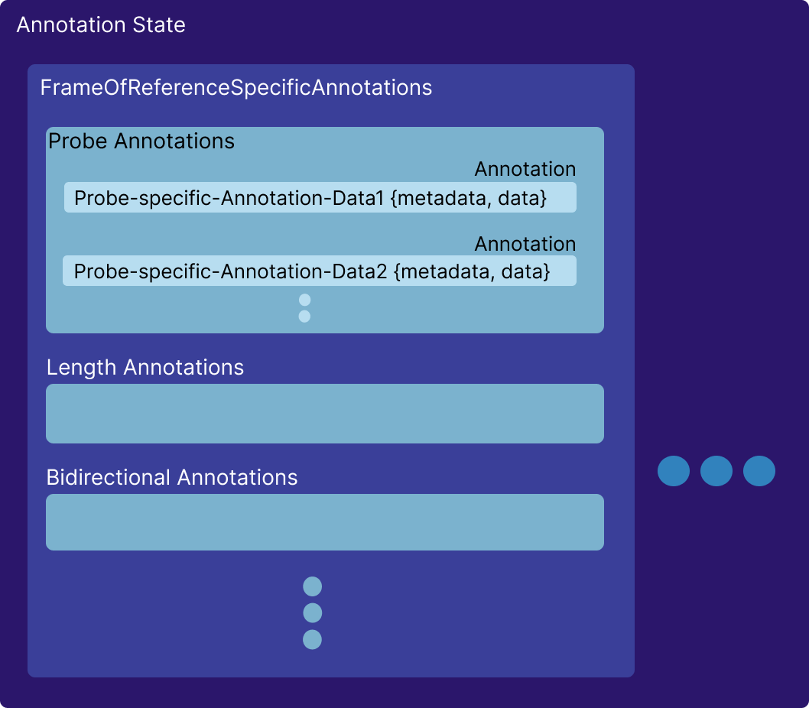

---

id: state  
title: 状态  
---

# 状态管理

`Cornerstone3DTools` 实现了一个 `FrameOfReference` 注释状态管理器，其中注释使用世界坐标来表示点。

## 注释数据

当创建一个新的注释（`addNewAnnotation` 方法在注释工具中）时，基于元数据和工具的当前状态创建新的注释数据，并将其添加到全局注释状态中。

以下是 `ProbeTool` 实例的注释数据。其他工具基本上遵循相同的模式。

```js
// ProbeTool 注释数据
const annotation = {
  invalidated: boolean, // 注释数据是否由于例如移动其控制点而无效
  highlighted: boolean, // 注释是否被鼠标悬停高亮显示
  annotationUID: string, // 注释的 UID
  metadata: {
    viewPlaneNormal: Types.Point3, // 相机的视平面法线
    viewUp: Types.Point3, // 相机的视上向量
    FrameOfReferenceUID: string, // 注释所在视口的 FrameOfReferenceUID
    referencedImageId?: string, // 注释所在的图像 ID（如适用）
    toolName: string, // 工具名称
  },
  data: {
    handles: {
      points: [Types.Point3], // 控制点的世界坐标（probe 工具 = 1 个控制点 = 1 个 x,y,z 点）
    },
    cachedStats: {}, // 注释的存储统计信息
  },
}
```

## 注释状态

注释状态跟踪每个 `FrameOfReference` 的注释。状态由一个特定于 `FrameOfReference` 的状态对象组成，其中存储每个注释特定的状态。下面，您可以看到状态对象的高级概览。

<div style={{textAlign: 'center', width:"80%"}}>



</div>

## API

您可以使用以下 API 获取/添加注释：

```js
// 添加注释
cornerstone3DTools.annotation.state.addAnnotation(
  annotation,
  element,
  suppressEvents
);

// 根据注释引用移除注释
cornerstone3DTools.annotation.state.removeAnnotation(
  annotationUID,
  suppressEvents
);

// 返回给定工具的所有注释
cornerstone3DTools.annotation.state.getAnnotations(toolName, element);

// 一个助手函数，返回匹配 UID 的单个注释条目
cornerstone3DTools.annotation.state.getAnnotation(annotationUID);
```

## 阅读更多

:::note TIP  
关于状态 API 的更多信息，请 [**点击这里**](/api/tools/namespace/annotation#state)  
:::