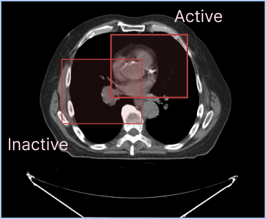

---

id: active-segmentation  
title: 活跃分割  
sidebar_position: 3
---

# 活跃分割



每个视口可以同时显示多个分割表示，但每个视口只能有一个活跃分割。活跃分割是将被分割工具修改的分割。

您可以为活跃和非活跃分割设置不同的样式。例如，您可以为每个视口中的活跃分割和非活跃分割配置不同的填充和轮廓属性。

如上图所示，您可以在同一个视口中显示多个标签图分割。默认情况下，活跃分割的轮廓宽度较大，以使其在视觉上与非活跃分割更为区分。

## 视口特定的活跃分割

在 2.x 版本中，一个重要的概念是活跃分割是视口特定的。这意味着：
- 每个视口可以有其自己的活跃分割
- 同一个分割可以在一个视口中是活跃的，在另一个视口中是非活跃的
- 分割工具仅会修改它们被使用的视口中的活跃分割

## API

活跃分割 API 提供了获取和设置每个视口的活跃分割的方法：

```js
import { segmentation } from '@cornerstonejs/tools';

// 获取视口的活跃分割
const activeSegmentation = segmentation.getActiveSegmentation(viewportId);

// 设置视口的活跃分割
segmentation.setActiveSegmentation(viewportId, segmentationId);
```

### 获取活跃分割数据

一旦您获取了活跃分割，您可以访问各种属性：

```js
const activeSegmentation = segmentation.getActiveSegmentation(viewportId);
```

### 使用多个视口

不同的视口可以有不同的活跃分割：

```js
// 为不同的视口设置不同的活跃分割
segmentation.setActiveSegmentation('viewport1', 'segmentation1');
segmentation.setActiveSegmentation('viewport2', 'segmentation2');

// 检查活跃分割
const activeInViewport1 = segmentation.getActiveSegmentation('viewport1');
const activeInViewport2 = segmentation.getActiveSegmentation('viewport2');
```

请记住，在执行操作时，工具将尊重这些视口特定的活跃分割。