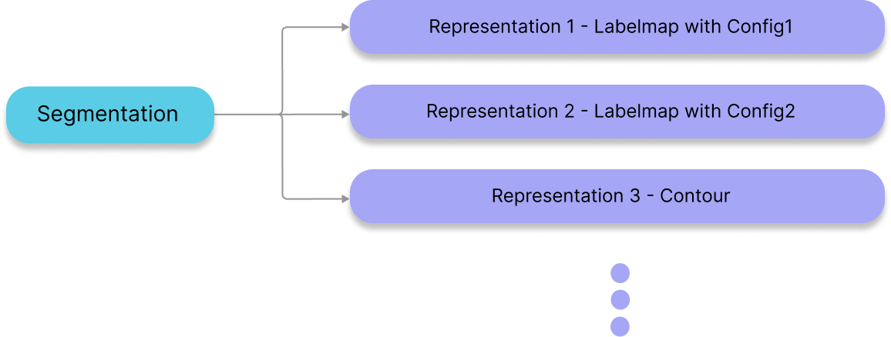

---

id: index  
title: 分割  
sidebar_position: 1
---

# 分割

在 `Cornerstone3DTools` 中，我们已将 `Segmentation` 的概念与 `Segmentation Representation` 解耦。这意味着从一个 `Segmentation` 中，我们可以创建多个 `Segmentation Representation`。例如，可以从一个 `Segmentation` 数据创建一个 3D 标签图的 `Segmentation Representation`，并且可以从相同的 `Segmentation` 数据创建一个轮廓的 `Segmentation Representation`（尚未支持）。通过这种方式，我们将 `Segmentation` 的展示层面与其底层数据解耦。



:::note TIP  
类似的关系结构已被应用于流行的医学影像软件，如 [3D Slicer](https://www.slicer.org/)，并添加了 [多态分割](https://github.com/PerkLab/PolySeg)。  
:::

## API

与 `Segmentation` 相关的函数和类可以在 `segmentation` 模块中找到。

```js
import { segmentation } from '@cornerstonejs/tools';

// 存储所有分割及其工具组特定表示的分割状态
segmentations.state.XYZ;

// 活跃分割方法（设置/获取）
segmentations.activeSegmentation.XYZ;

// 锁定分割索引（设置/获取）
segmentations.locking.XYZ;

// 分割索引操作（设置/获取）
segmentations.segmentIndex.XYZ;
```

让我们深入了解这些方法。