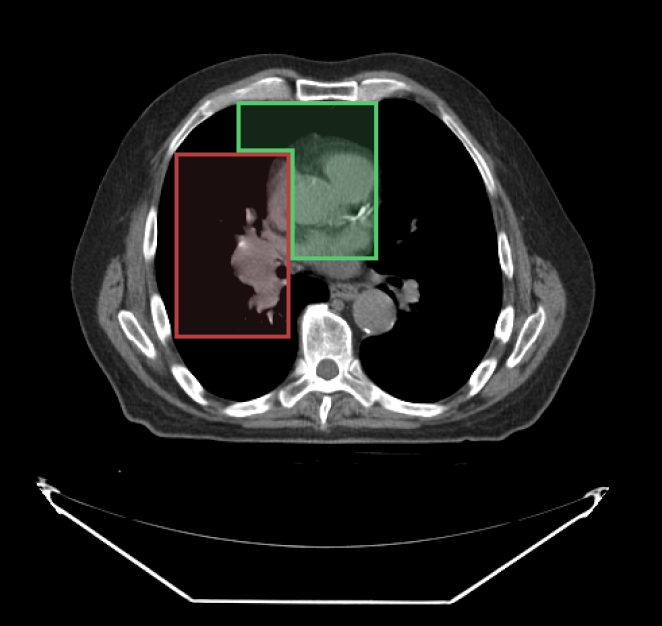

---  
id: segment-index  
title: 分割索引  
---  

# 分割索引

在使用分割工具绘制时，您可以指定使用哪个分割索引。下图中，我们使用了 `SegmentIndex` API 来更改 `segmentIndex` 以绘制第二个分割。

<div style={{textAlign: 'center', width: '500px'}}>



</div>

## API

```js
import { segmentation } from '@cornerstonejs/tools';

// 获取分割ID的活动分割索引
segmentation.segmentIndex.getActiveSegmentIndex(segmentationId);

// 设置分割ID的活动分割索引
segmentation.segmentIndex.setActiveSegmentIndex(segmentationId, segmentIndex);
```