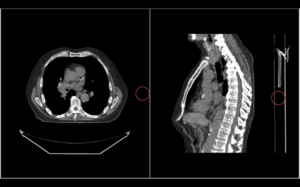
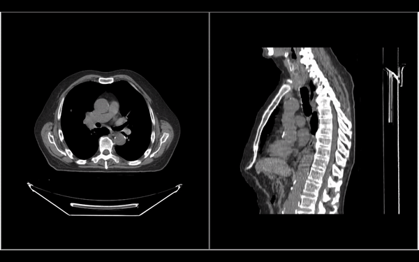
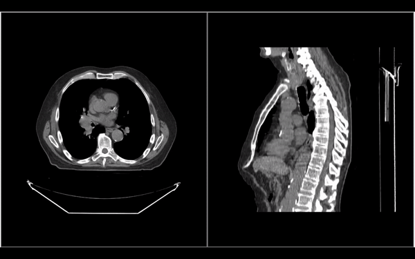
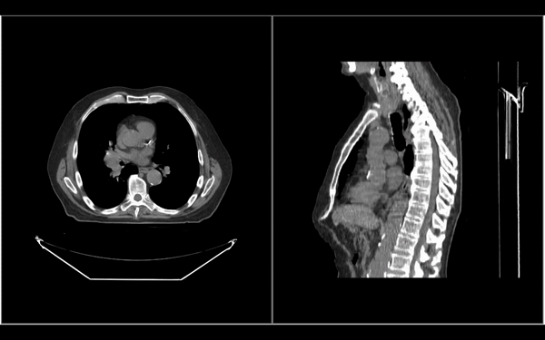
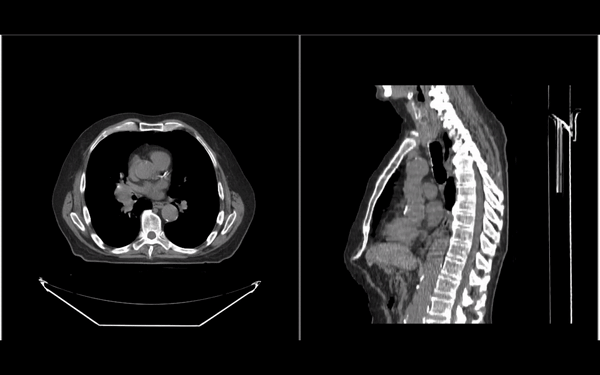

---  
id: segmentation-tools  
title: 分割工具  
---  

# 分割工具

`Cornerstone3DTools` 提供了一组用于修改分割的工具。这些工具包括 `BrushTool`、剪刀（如 `RectangleScissor`、`CircleScissor`、`SphereScissor`）和 `RectangleRoiThresholdTool`。我们将在下面更详细地介绍每个工具。

:::note 提示  
所有分割工具都可以在所有3D视图（轴向、冠状面和矢状面）中编辑分割。  
:::  

## 刷子工具

`BrushTool` 是最常用的分割工具。它允许用户通过点击和拖动来绘制分割（如下所示）。

要使用此工具，您需要像其他工具一样将其添加到工具组中。请参阅[工具](../tools.md#adding-tools)和[工具组](../toolGroups.md#toolgroup-creation-and-tool-addition)部分，了解如何激活工具。

## 矩形剪刀工具

`RectangleScissorTool` 可用于创建矩形分割。

## 圆形剪刀工具

`CircleScissorTool` 可用于创建圆形分割。

## 球形剪刀工具

`SphereScissorTool` 可用于创建球形分割。它在鼠标指针周围绘制一个3D球体。

## 阈值工具

`RectangleROIThresholdTool` 可用于通过用户绘制区域的阈值来创建分割。

（下图中，设置了某个阈值来创建分割）

