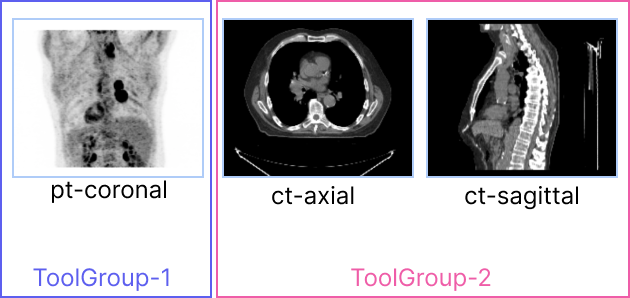

---  
id: toolGroups  
title: 工具组  
---  

## 介绍  

如在 [`Tools`](./tools.md) 部分讨论的那样，要使用工具，您应该首先通过 `CornerstoneTools3D.addTool()` 添加工具，然后通过 `Tool Groups` 将工具添加并设置为视口的活动工具。  

工具组是 `Cornerstone` 库中的一个新概念。`ToolGroup` 的目标是定义一种简单的方式，以每个视口/每个工具的方式定义工具行为。此外，通过一个共同的 `ToolGroup`，视口可以共享相同的配置、模式和工具。  

考虑以下视口集以及滚动和平移的预期行为。  

<div style={{textAlign: 'center'}}>


</div>  

对于 `ct-axial` 和 `ct-sagittal` 视口，我们希望启用鼠标滚轮滚动和鼠标中键拖动平移。然而，对于 `pt-coronal` 视口，它是一个最大强度投影（MIP）视口，滚动切片没有意义，预期行为是通过鼠标滚轮旋转 MIP 卷，并禁用平移。  

<div style={{textAlign: 'center'}}>



</div>  

:::note 重要  
视口与工具组之间存在一一对应的关系。换句话说，任何视口不能属于多个工具组。  
:::  

## 工具组创建与工具添加  

`ToolGroups` 由 `ToolGroupManager` 管理。工具组管理器用于创建、搜索和销毁工具组。  

> 目前，工具组是必需的，为了使用工具，您必须创建工具组并将其添加到工具组中。  

可以使用 `createToolGroup` 方法通过 `ToolGroupManager` 创建工具组。  

```js  
import { ToolGroupManager } from '@cornerstonejs/tools';  

const toolGroupId = 'ctToolGroup';  
const ctToolGroup = ToolGroupManager.createToolGroup(toolGroupId);  

// 向工具组添加工具  
// 操作工具  
ctToolGroup.addTool(PanTool.toolName);  
ctToolGroup.addTool(ZoomTool.toolName);  
ctToolGroup.addTool(ProbeTool.toolName);  
```  

### 向工具组添加视口  

应使用 `addViewport` 将视口添加到 `ToolGroup` 中。  

```js  
// 将工具组应用于视口或所有渲染场景的视口  
ctToolGroup.addViewport(viewportId, renderingEngineId);  
```  

<details>  
<summary>  
为什么需要传递 `renderingEngineId`？  
</summary>  

原因是 `viewportId` 对于每个渲染引擎是唯一的。您可以有多个渲染引擎，其中包含具有相同 `viewportId` 的不同视口。  

</details>  

### 激活工具  

可以使用 `setToolActive` 为每个工具组激活工具，并提供相应的鼠标绑定键。  

```js  
// 为每个工具设置 ToolGroup 的工具模式  
// 可用模式包括：'Active'，'Passive'，'Enabled'，'Disabled'  
ctToolGroup.setToolActive(LengthTool.toolName, {  
  bindings: [{ mouseButton: MouseBindings.Primary }],  
});  
ctToolGroup.setToolActive(PanTool.toolName, {  
  bindings: [{ mouseButton: MouseBindings.Auxiliary }],  
});  
ctToolGroup.setToolActive(ZoomTool.toolName, {  
  bindings: [{ mouseButton: MouseBindings.Secondary }],  
});  
ctToolGroup.setToolActive(StackScrollMouseWheelTool.toolName);  
```  

其他工具模式也可以通过 `setToolEnabled`、`setToolPassive` 和 `setToolDisabled` 设置。  

## 工具组管理器  

可以通过 `ToolGroupManager` 使用其他方法来管理工具组。  

### `getToolGroupForViewport`  

返回给定视口的工具组，详情请阅读 [这里](/api/tools/namespace/ToolGroupManager#getToolGroupForViewport)  

### `getToolGroup`  

返回给定 `toolGroupId` 的工具组  

### `destroyToolGroup`  

销毁一个工具组