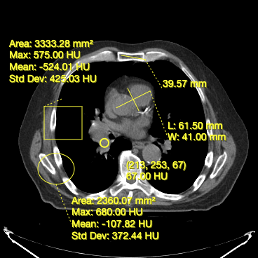

## 介绍

工具是一个未实例化的类，至少实现了 `BaseTool` 接口。  
工具可以通过其构造函数进行配置。要使用工具，必须：

- 使用库的顶层 `addTool` 函数添加未实例化的工具
- 通过名称将该工具添加到一个工具组

在这里，我们将介绍 `Cornerstone3DTools` 中的一些工具（注释和分割工具）概念。

## 工具

### 操作工具

`Cornerstone3DTools` 提供了一组可以用于操作视口中图像的工具。这些工具包括：

- 启用图像的缩放（`ZoomTool`）
- 执行图像的平移和导航（`PanTool`）
- 滚动浏览图像（`StackScrollMouseWheelTool`）
- 操控图像的窗口级别（`WindowLevelTool`）

### 注释工具

`Cornerstone3DTools` 提供了一组注释工具。您可以使用这些工具来创建和编辑注释，适用于以下用例：

- 测量两点之间的距离（Length Tool）
- 测量两点之间的高度（Height Tool）
- 测量结构的宽度和长度（Bidirectional Tool）
- 测量矩形区域的面积和统计数据（RectangleRoi Tool）
- 测量椭圆的体积和统计数据（EllipseRoi Tool）
- 获取体素的底层值（Probe Tool）

下面，您可以看到 `Cornerstone3DTools` 中可用的注释工具的屏幕截图。

<div style={{textAlign: 'center'}}>



</div>

### 动态工具统计

`Cornerstone3DTools` 能够根据渲染的体积的成像模式计算动态统计。例如，对于 CT 体积，`ProbeTool` 会给出 Hounsfield 单位，对于 PET 它会计算 SUV 统计数据。

<div style={{textAlign: 'center', width:'85%'}}>


</div>

### 在参考框架中共享注释

由于注释存储在患者的物理空间中，如果有两个视口显示相同的参考框架，它们将共享相同的注释。

### 分割工具

`Cornerstone3D` 还提供了分割工具。这些包括 3D 分割编辑工具，如刷子、矩形和圆形剪刀，以及 3D 球体工具。

我们将在 [`Segmentation`](./segmentation/index.md) 部分详细讨论不同类型的分割工具及其在 `Cornerstone3DTools` 中的使用。

<details>

<summary>工具如何在内部工作</summary>

鼠标和键盘触发事件，这些事件被 `Cornerstone3DTools` 捕获并规范化。然后，规范化的事件会作为 `mouseDown`、`mouseDrag` 和 `mouseUp` 事件触发并由工具处理。

</details>

<div style={{textAlign: 'center', width:'85%'}}>


</div>

## 添加工具

`Cornerstone3DTools` 库附带了几个常用工具。所有工具都实现了 `BaseTool` 或 `AnnotationTool`。为了能够使用这些工具，您必须先将它们添加到 `Cornerstone3DTools`。可以使用 `addTool` 函数来完成此操作。

```js
import * as csTools3d from "@cornerstonejs/tools";

const { PanTool, ProbeTool, ZoomTool, LengthTool } = csTools3d;

csTools3d.addTool(PanTool);
csTools3d.addTool(ZoomTool);
csTools3d.addTool(LengthTool);
csTools3d.addTool(ProbeTool);
```

:::note warning  
将工具添加到库中只会让库知道该工具。  
它不会自动将工具添加到任何工具组中，也不会实例化该工具以供使用。  
:::

## 工具模式

工具（在其工具组中）可以处于四种模式之一。每种模式会影响工具对交互的响应。

> 不应该有两个具有相同绑定的活动工具

<table>  
  <tr>  
    <td>工具模式</td>  
    <td>描述</td>  
  </tr>  
  <tr>  
    <td>活动</td>  
    <td>  
      <ul>  
        <li>具有活动绑定的工具将响应交互</li>  
        <li>如果该工具是注释工具，则点击事件如果不在现有注释上，将创建一个新的注释。</li>  
      </ul>  
    </td>  
  </tr>  
  <tr>  
    <td>被动（默认）</td>  
    <td>  
      <ul>  
        <li>如果该工具是注释工具，并且其句柄或线条被选中，则可以移动和重新定位。</li>  
      </ul>  
    </td>  
  </tr>  
  <tr>  
    <td>启用</td>  
    <td>  
      <ul>  
        <li>该工具将渲染，但不能进行交互。</li>  
      </ul>  
    </td>  
  </tr>  
  <tr>  
    <td>禁用</td>  
    <td>  
      <ul>  
        <li>该工具将不渲染。无法进行交互。</li>  
      </ul>  
    </td>  
  </tr>  
</table>
