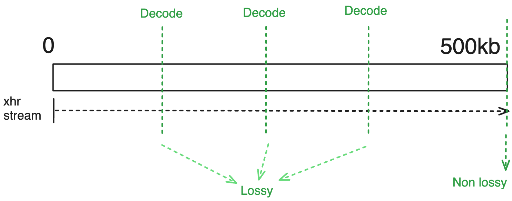

---  
id: retrieve-configuration  
title: 获取配置  
toc_max_heading_level: 5  
---  

# 获取配置

渐进加载按称为“阶段”的步骤进行。每个阶段是**哪些图像以哪些设置加载**的一部分，您可以为每个阶段设置不同的设置，这些设置被称为`retrieve options`（获取选项）。阶段和选项一起构成了`retrieve configuration`（获取配置），管理图像的逐步加载。让我们深入了解。

```ts
interface IRetrieveConfiguration {
  stages: RetrieveStage[];  
  retrieveOptions: Record<string, RetrieveOptions>;  
}
```

## 获取阶段

正如渐进加载的名称所暗示的那样，加载过程是按`阶段`进行的。每个`阶段`可以配置为使用不同的获取方法（流式传输或字节范围），以及其共同或特定的获取选项。

:::info  
由于您可以有多个阶段，因此可以在不同的阶段组合并使用这两种方法（流式传输和字节范围）。

例如，您可以创建一个配置：

1. 开始**流式传输**特定的初始切片（通常是第一、中间或最后一个切片）以进行即时查看。
2. 随后，在第二阶段，可以进行**字节范围请求**（只有几KB），以高效渲染完整的体积数据（即使是有损的）。
3. 最后，执行补充的**字节范围请求**，以获取尚未请求的剩余部分，跟随步骤2中的初始字节范围请求。

这种方法实际上在体积加载过程中被采用，我们将在后续讨论中进一步阐述。
:::

总之，获取阶段是一个配置，指定哪些图像以哪些设置加载。为了简化本文的讨论并避免跑题，我们将仅讨论`retrieveType`，它只是对获取选项的引用。我们将在后面讨论更高级的选项，例如为策略选择图像、优先级排序和队列加载。


<!--  -->

如上所示，获取阶段可以简单地是一个对象列表，每个对象具有`id`和`retrieveType`（这是对获取选项的引用，稍后我们将讨论）。

:::tip  
`retrieveType`是一个可选字符串，仅用于引用要使用的选项。只要您在获取选项中保持一致，您可以使用任何字符串。比如，如果您愿意，可以使用`'lkajsdflkjaslfkjsadlkfj'`（但在`retrieveOptions`对象中应该有一个键为`'lkajsdflkjaslfkjsadlkfj'`的对象，正如我们下面将看到的那样）。
:::

<details>  
<summary>  
如果我们引用了一个在获取选项中未定义的获取类型，会发生什么？  
</summary>  

Cornerstone 会检查是否指定了`default`获取选项，如果为真，它将使用该选项，否则将忽略渐进加载配置，像以前一样加载图像，仿佛渐进加载未启用。

</details>

## 获取选项

现在我们可以更详细地讨论每种方法（流式传输或字节范围）的获取选项。首先，让我们讨论常见的选项。

### 常见选项

获取配置还有一些更高级的选项，可以用于处理更多的使用场景。我们将在另一个部分讨论它们。

#### 解码级别（质量）

一个可能出现的自然问题是，无论使用哪种方法（流式传输或字节范围），图像多久解码一次，以及我们在解码时应该解码到什么分辨率？

解码的分辨率由`decodeLevel`配置控制，值可以是：

- 0 = 全分辨率
- 1 = 半分辨率
- 2 = 四分之一分辨率
- 3 = 八分之一分辨率
- ...

所以，如果一个阶段的`decodeLevel`设置为0，则图像将解码为全分辨率。如果设置为1，则图像将解码为半分辨率（x/2, y/2），依此类推。

:::tip  
对于体积视图窗口，目前我们不允许解码为子分辨率，因为这需要在内存中重新分配体积，这效率较低。因此，如果数据是部分的并且不能解码为全分辨率，我们会简单地复制它（在Web工作线程中以提高性能），以填充整个体积。

但是，对于堆栈视图窗口，我们允许解码为子分辨率，因为这比重新分配整个体积更便宜。此外，在这种情况下，未来增强的图像质量将覆盖旧图像，并创建一个具有新尺寸的新图像，直到达到全分辨率。
:::

我们将在下面每种方法的部分中讨论`frequency`。

### 流式传输选项

#### 选项

对于流式请求，您可以配置以下选项：

- `streaming`：是否使用流式传输

#### 解码频率

通常，当流来自服务器时，服务器会告诉客户端数据的最终大小。因此，在每个时间点，我们可以识别已下载的数据的百分比，并解码图像到相关的分辨率，因此在流式传输场景中，您实际上不必手动设置它。

不同的级别如下，如果解码时已下载的部分为：

- \< 8 \% 的总数据，则解码为级别 3
- 8 \< x \< 13 \% 的总数据，则解码为级别 2
- 13 \< x \< 27 \% 的总数据，则解码为级别 1
- \< 100（意味着尚未完成），则解码为级别 0
- 100 \% 的总数据（流已完成），则解码为级别 0

:::tip  
我们是如何得出这些级别的？其实很简单。

例如，如果我们只下载了总数据的1/16，那么我们已经下载了6.25%的数据（8%是6.25%加上一些偏差）。这意味着我们可以将图像解码为原始大小的1/16，即级别4。然而，解码器提供的插值比直接图像渲染稍好，因此我们可以将其解码为稍低的级别，使用级别3。

其余级别也是如此。
:::

关于解码级别发生多少次，完全取决于初始下载的数据以及流的进展。但在任何给定的时刻，当数据下载时，我们会根据上述级别检查进度，并尽可能将图像解码为相关的分辨率。如果发生错误或图像无法解码，我们将简单地等待下一个进度事件的发生。

#### 示例

对于简单的流式加载场景（`streaming: true`），你应该期望以下行为：



#### 用例

使用流式方法适用于以下场景：你最终需要数据的完整分辨率，并且希望尽早开始查看数据。

### 字节范围选项

#### 选项

- `chunkSize`：用于初始解码的字节范围值（默认值为64kb）。对于除第一次范围请求外的所有请求都将被忽略（无论`rangeIndex`如何）。
- `rangeIndex`：你想要获取的范围编号（索引），-1表示剩余数据。

请注意，无法保证`rangeIndex`会实际获取另一个范围，因为一旦所有数据已被获取，范围请求将停止。同时，`-1`用于标记“剩余”数据。

#### 解码频率

字节范围请求有两种场景：

- 如果服务器在响应头中返回了数据的总大小，我们将使用自动解码频率（类似于流式加载场景）。
- 如果服务器没有在响应头中返回数据的总大小，我们将等待直到范围请求完成，然后再解码图像。

:::tip
服务器应发送CORS头`Access-Control-Expose-Headers: *`，以便读取`Range-Response`头所需的总大小。否则，范围请求将在`multipart/related`头完成时结束，或者返回的数据小于请求的数据。
:::

#### 示例

例如，对于以下选项：

```js
{
  rangeIndex: 0,
  chunkSize: 256000, // 256kb
}
```


另一个示例：

```js
{
  rangeIndex: 0,
  decodeLevel: 3
}

// chunkSize是默认的64kb
```


:::tip
你可以通过使用`rangeIndex: -1`来获取剩余的数据。另外，`rangeIndex = 0`将始终是第一个块。

例如，如果你有4个范围，则你的范围将是：

- `rangeIndex 0`：`0`到`chunkSize-1`（以字节为单位）
- `rangeIndex 5`：`chunkSize`到`5 * chunkSize-1`（以字节为单位）
- `rangeIndex 25`：`5 * chunkSize`到`25 * chunkSize-1`（以字节为单位）
- `rangeIndex -1`：`25 * chunkSize`到`totalSize`（以字节为单位）——其余数据

这种`rangeIndex`的使用可以获取较大的增量，以适应`decodeLevel`值所需的数据量。
:::

<details>
<summary>
如果我从范围1开始，而不是范围0，会发生什么？
</summary>

Cornerstone会自动将范围0与范围1合并为一个请求，这样就避免了需要进行多个中间请求。
</details>

#### 用例

除了我们可以使用范围请求来逐步请求并加载更高质量的图像之外，还有一些其他的用例：

- 缩略图：通常，对于缩略图，我们希望尽可能快地加载图像，但不需要完整分辨率。我们可以使用字节范围请求来获取数据的低分辨率版本。
- CINE：对于某些成像需求，帧率在电影模式下至关重要。在这些场景中，通常需要的是粗略解剖学而不是细节，但帧率更为重要。我们可以使用字节范围请求来获取数据的子分辨率，保证我们可以实现目标帧率。

将来，可能会使用单独的内存缓存来存储范围请求的详细信息，但目前中间数据是与图像数据一起存储的。将其存储在缓存中将允许CINE显示，只需解码图像的成本。

## 结论

所以，我们了解到“检索配置”由至少一个（可以有多个）“检索阶段”和一个附带的“检索选项”组成，后者在“检索阶段”中被引用。我们还了解到，每个“检索阶段”可以配置为使用不同的方法（流式加载或字节范围），并具有通用或特定的检索选项。

让我们看看堆叠渐进演示中的一个示例：

```js
const retrieveConfiguration = {
  stages: [
    {
      id: 'initialImages',
      retrieveType: 'single',
    },
  ],
  retrieveOptions: {
    single: {
      streaming: true,
    },
  },
};
```

:::tip
注意`stages`和`retrieveOptions`对象中都使用了“single”。这只是对我们在`retrieveOptions`对象中定义的检索选项的引用。
:::

现在你的问题可能是，我们如何[使用这个配置](./usage)？我们将在下一节讨论这个问题。对于好奇的读者，可以前往高级配置部分，了解更多关于检索配置的高级选项。
