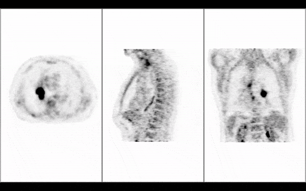

import Link from '@docusaurus/Link';

# 概述

`Cornerstone3D` 是一个轻量级的 JavaScript 库，用于在支持 HTML5 canvas 元素的现代网页浏览器中可视化医学图像。使用 `@cornerstonejs/core` 及其配套库如 `@cornerstonejs/tools`，您可以完成广泛的成像任务。

 

<Link target={"_blank"} to="/live-examples/petCT.html">
    <button id="open-ptct-button">
        打开 PT/CT 演示
    </button>
</Link>

 
 

<Link target={"_blank"} to="/live-examples/local.html">
    <button id="open-ptct-button">
        打开本地 DICOM 演示
    </button>
</Link>

## 特性

### 渲染

使用新的 `Cornerstone3D` 渲染引擎及其堆栈和体积视口，您可以：

- 渲染所有传输语法，包括各种压缩格式如 JPEG2000、无损 JPEG
- 流式传输体积的切片，并在加载时实时查看
- 在不同方向（如轴向、矢状、冠状）查看同一体积，而无需重新加载整个体积（最小内存占用）
- 在体积中查看倾斜切片
- 渲染同一体积的不同混合（例如，MIP（最大强度投影）和平均强度投影）
- 融合和叠加多张图像，如 PET/CT 融合
- 渲染彩色图像并将其渲染为体积
- 在 GPU 渲染不可用时回退到 CPU 渲染
- 通过修改视口的元数据（例如像素间距）更改图像的校准

### 操作

`Cornerstone3DTools` 启用以下功能：

- 使用鼠标绑定进行图像的放大和缩小
- 在任何方向平移图像
- 即使在倾斜切片中，也能在任何方向滚动图像
- 更改图像的窗口级别

### 注释

`Cornerstone3DTools` 还支持使用工具对图像进行注释。所有注释都以 SVG 元素渲染，确保它们在任何显示器分辨率下都以最佳质量显示。`Cornerstone3DTools` 中的注释存储在图像的实际物理空间中，这使您能够在多个视口中渲染/修改相同的注释。此外，您可以：

- 使用工具组在特定视口上激活某些工具（例如，在滚动时在 CT 轴向视口上激活切片滚动，但在 PT MIP 视口上激活体积旋转）
- 使用长度工具测量两点之间的距离
- 使用双向线工具测量长度和宽度
- 使用矩形/椭圆 ROI 工具计算感兴趣区域的平均值、标准差等统计数据
- 使用十字准线在不同视口的图像中找到对应点，并使用参考线导航切片
- 在按住特定修饰键（例如 Shift、Ctrl、Alt）时分配不同的工具以激活
- 创建您自己的自定义工具

### 分割

`Cornerstone3D` 支持在所有视口中将图像的分割渲染为标签图，包括堆栈、体积和 3D 视口。您可以：

- 在视口中将分割渲染为标签图（例如 CT 肺部分割）
- 将标签图转换为 3D 视口中的表面并应用相同的颜色
- 在任何方向（例如轴向、矢状、冠状）查看分割，即使在倾斜切片中
- 更改标签图配置（例如颜色、不透明度、轮廓渲染、轮廓厚度等）
- 使用剪刀工具（如矩形、椭圆剪刀）在 3D 轴向、矢状、冠状中编辑/绘制分割
- 对感兴趣区域的标签图应用特定阈值

### 同步

`Cornerstone3D` 支持多个视口之间的同步。目前，已经实现了两种同步器，我们正在开发更多。

- WindowLevel 同步器：同步源视口和目标视口的窗口级别
- 摄像机同步器：同步源视口和目标视口的摄像机

## 关于本文档

我们的文档可以分为以下几个部分：

- [**入门**](/docs/category/getting-started)：涵盖项目范围、相关库及其他相关信息，以及安装说明
- [**教程**](/docs/category/tutorials)：提供一系列不同任务的教程，如渲染、工具、分割
- [**操作指南**](/docs/category/how-to-guides)：提供更高级任务的指南，如自定义加载器、自定义元数据提供器
- [**概念**](/docs/category/concepts)：深入解释库中使用的各种技术概念
- [**贡献**](/docs/category/contributing/)：解释如何为项目做出贡献以及如何报告错误
- [**迁移指南**](/docs/migrationGuides)：包括从旧版本升级到新版本库的说明，以及从 1.x 升级到 2.x 的说明
- [**常见问题**](/docs/faq)：提供常见问题的解答
- [**帮助**](/docs/help)：提供如何获取库帮助的信息
- [**测试覆盖报告**](/test-coverage/)：提供库的测试覆盖率详细报告
- [**示例**](/docs/examples)：展示库的实时示例
- [**API 参考**](/api)：提供 API 的详细描述及如何使用每个函数

如果某个页面不再是最新的，您可以通过修改 `/packages/docs/docs/*.md` 中的文件来撰写 PR 以更新它。有关如何贡献的更多信息，请阅读[这里](../contribute/pull-request.md)。