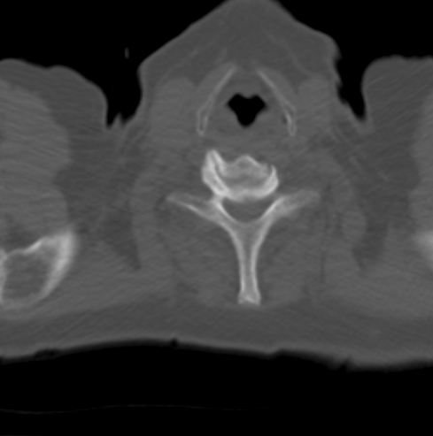

---  
id: basic-manipulation-tool  
sidebar_position: 5
---  

# 操作工具

在本教程中，您将学习如何添加缩放操作工具。

## 前言

为了渲染体积数据，我们需要：

- 初始化库
- 一个 HTMLDivElement 用于渲染视口
- 图像路径（`imageId`）

## 实现

**初始化 cornerstone 和相关库**

```js
import { init as coreInit } from '@cornerstonejs/core';
import { init as dicomImageLoaderInit } from '@cornerstonejs/dicom-image-loader';
import { init as cornerstoneToolsInit } from '@cornerstonejs/tools';

await coreInit();
await dicomImageLoaderInit();
await cornerstoneToolsInit();
```

为了本教程，我们已经将图像存储在服务器上。

首先，让我们创建一个 HTMLDivElement，并对其进行样式设置。

```js
const content = document.getElementById('content');

const element = document.createElement('div');

// 禁用默认的右键菜单
element.oncontextmenu = (e) => e.preventDefault();
element.style.width = '500px';
element.style.height = '500px';

content.appendChild(element);
```

接下来，我们需要一个 `renderingEngine`。

```js
const renderingEngineId = 'myRenderingEngine';
const renderingEngine = new RenderingEngine(renderingEngineId);
```

在这个示例中，我们可以使用 StackViewport。

```js
const viewportId = 'CT_AXIAL_STACK';

const viewportInput = {
  viewportId,
  element,
  type: ViewportType.STACK,
};

renderingEngine.enableElement(viewportInput);
```

RenderingEngine 将处理视口的创建，我们可以获取视口对象并设置图像。

```js
const viewport = renderingEngine.getViewport(viewportId);

viewport.setStack(imageIds);

viewport.render();
```

为了使用操作工具，我们需要通过 `addTool` API 将它们添加到 `Cornerstone3DTools` 的内部状态中。

```js
addTool(ZoomTool);
addTool(WindowLevelTool);
```

接下来，创建一个 ToolGroup 并添加我们要使用的工具。  
ToolGroups 使得在多个视口之间共享工具成为可能，因此我们还需要让 ToolGroup 知道它应该在哪些视口上操作。

```js
const toolGroupId = 'myToolGroup';
const toolGroup = ToolGroupManager.createToolGroup(toolGroupId);

toolGroup.addTool(ZoomTool.toolName);
toolGroup.addTool(WindowLevelTool.toolName);

toolGroup.addViewport(viewportId, renderingEngineId);
```

:::note 提示

为什么要将 `renderingEngineUID` 添加到 ToolGroup 中？  
因为 `viewportId` 在每个 `renderingEngine` 中是唯一的。

:::

接下来，设置工具为激活状态，这意味着我们还需要为该工具定义绑定（哪个鼠标按钮使其激活）。

```js
// 设置 WindowLevel 工具为激活状态，当鼠标左键按下时激活
toolGroup.setToolActive(WindowLevelTool.toolName, {
  bindings: [
    {
      mouseButton: csToolsEnums.MouseBindings.Primary, // 左键点击
    },
  ],
});

toolGroup.setToolActive(ZoomTool.toolName, {
  bindings: [
    {
      mouseButton: csToolsEnums.MouseBindings.Secondary, // 右键点击
    },
  ],
});
```

## 完整代码

<details>
<summary>完整代码</summary>

```js
import { init as coreInit, RenderingEngine, Enums } from '@cornerstonejs/core';
import { init as dicomImageLoaderInit } from '@cornerstonejs/dicom-image-loader';
import {
  init as cornerstoneToolsInit,
  ToolGroupManager,
  WindowLevelTool,
  ZoomTool,
  Enums as csToolsEnums,
  addTool,
} from '@cornerstonejs/tools';
import { createImageIdsAndCacheMetaData } from '../../../../utils/demo/helpers';

const { ViewportType } = Enums;

const content = document.getElementById('content');

const element = document.createElement('div');

// 禁用默认的右键菜单
element.oncontextmenu = (e) => e.preventDefault();
element.style.width = '500px';
element.style.height = '500px';

content.appendChild(element);
// ============================= //

/**
 * 运行示例
 */
async function run() {
  await coreInit();
  await dicomImageLoaderInit();
  await cornerstoneToolsInit();

  const imageIds = await createImageIdsAndCacheMetaData({
    StudyInstanceUID:
      '1.3.6.1.4.1.14519.5.2.1.7009.2403.334240657131972136850343327463',
    SeriesInstanceUID:
      '1.3.6.1.4.1.14519.5.2.1.7009.2403.226151125820845824875394858561',
    wadoRsRoot: 'https://d14fa38qiwhyfd.cloudfront.net/dicomweb',
  });

  // 实例化渲染引擎
  const renderingEngineId = 'myRenderingEngine';
  const renderingEngine = new RenderingEngine(renderingEngineId);

  const viewportId = 'CT_AXIAL_STACK';

  const viewportInput = {
    viewportId,
    element,
    type: ViewportType.STACK,
  };

  renderingEngine.enableElement(viewportInput);

  const viewport = renderingEngine.getViewport(viewportId);

  viewport.setStack(imageIds);

  viewport.render();

  const toolGroupId = 'myToolGroup';
  const toolGroup = ToolGroupManager.createToolGroup(toolGroupId);

  addTool(ZoomTool);
  addTool(WindowLevelTool);
  toolGroup.addTool(ZoomTool.toolName);
  toolGroup.addTool(WindowLevelTool.toolName);

  toolGroup.addViewport(viewportId);

  toolGroup.setToolActive(WindowLevelTool.toolName, {
    bindings: [
      {
        mouseButton: csToolsEnums.MouseBindings.Primary, // 左键点击
      },
    ],
  });

  toolGroup.setToolActive(ZoomTool.toolName, {
    bindings: [
      {
        mouseButton: csToolsEnums.MouseBindings.Secondary, // 右键点击
      },
    ],
  });
  viewport.render();
}

run();
```

</details>



## 了解更多

了解更多关于：

- [ToolGroup](../concepts/cornerstone-tools/toolGroups.md)
- [Tools](../concepts/cornerstone-tools/tools.md)