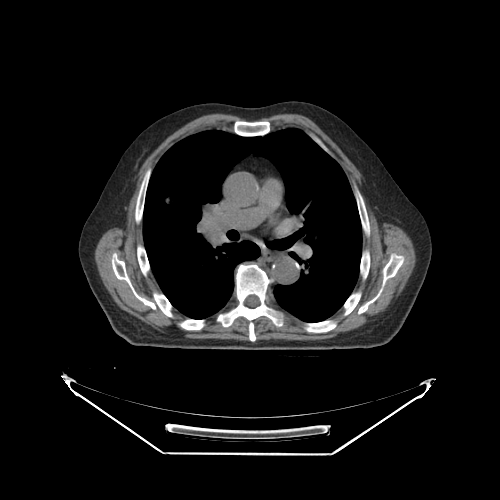

---

id: basic-stack
sidebar_position: 2
---

# 渲染图像堆栈

在本教程中，您将学习如何渲染一组图像。

## 前言

为了渲染一组图像，我们需要：

- 初始化库
- 一个`element`（HTMLDivElement）作为视口的容器
- 图像的路径（`imageId`）

## 实现

我们已经将图像存储在服务器上，供本教程使用。

1. 初始化库

```js
import { init as coreInit } from '@cornerstonejs/core';
import { init as dicomImageLoaderInit } from '@cornerstonejs/dicom-image-loader';

await coreInit();
await dicomImageLoaderInit();
```

2. 创建一个HTML元素并为其设置样式，使其看起来像一个视口。

```js
const content = document.getElementById('content');
const element = document.createElement('div');

element.style.width = '500px';
element.style.height = '500px';

content.appendChild(element);
```

接下来，我们需要一个`renderingEngine`和一个视口来渲染图像。

```js
const renderingEngineId = 'myRenderingEngine';
const renderingEngine = new RenderingEngine(renderingEngineId);
```

然后，我们可以通过使用`enableElement` API在`renderingEngine`中创建一个视口。请注意，由于我们不想渲染一个体积数据集，因此指定视口类型为`Stack`。

```js
const viewportId = 'CT_AXIAL_STACK';

const viewportInput = {
  viewportId,
  element,
};

renderingEngine.enableElement(viewportInput);
```

RenderingEngine将处理视口的创建，我们可以获取视口对象并设置图像，并选择要显示的图像索引。

:::info
我们在这里使用的`imageIds`是通过`createImageIdsAndCacheMetaData`函数生成的。

```js
const imageIds = await createImageIdsAndCacheMetaData({
  StudyInstanceUID:
    '1.3.6.1.4.1.14519.5.2.1.7009.2403.334240657131972136850343327463',
  SeriesInstanceUID:
    '1.3.6.1.4.1.14519.5.2.1.7009.2403.226151125820845824875394858561',
  wadoRsRoot: 'https://d14fa38qiwhyfd.cloudfront.net/dicomweb',
});
```

:::

```js
const viewport = renderingEngine.getViewport(viewportId);

viewport.setStack(imageIds, 60);

viewport.render();
```

:::note 提示
由于`imageIds`是一个图像ID数组，因此我们可以使用`setStack`的第二个参数来设置显示的图像索引。
:::

## 完整代码

<details>
<summary>查看完整代码</summary>

```js
import { RenderingEngine, Enums, init as coreInit } from '@cornerstonejs/core';
import { init as dicomImageLoaderInit } from '@cornerstonejs/dicom-image-loader';
import { createImageIdsAndCacheMetaData } from '../../../../utils/demo/helpers';

const content = document.getElementById('content');
const element = document.createElement('div');

element.style.width = '500px';
element.style.height = '500px';

content.appendChild(element);
// ============================= //

/**
 * 运行演示
 */
async function run() {
  await coreInit();
  await dicomImageLoaderInit();

  // 获取Cornerstone imageIds并将元数据加载到内存中
  const imageIds = await createImageIdsAndCacheMetaData({
    StudyInstanceUID:
      '1.3.6.1.4.1.14519.5.2.1.7009.2403.334240657131972136850343327463',
    SeriesInstanceUID:
      '1.3.6.1.4.1.14519.5.2.1.7009.2403.226151125820845824875394858561',
    wadoRsRoot: 'https://d14fa38qiwhyfd.cloudfront.net/dicomweb',
  });

  const renderingEngineId = 'myRenderingEngine';
  const renderingEngine = new RenderingEngine(renderingEngineId);

  const viewportId = 'CT_AXIAL_STACK';

  const viewportInput = {
    viewportId,
    element,
    type: Enums.ViewportType.STACK,
  };

  renderingEngine.enableElement(viewportInput);

  const viewport = renderingEngine.getViewport(viewportId);

  viewport.setStack(imageIds, 60);

  viewport.render();
}

run();
```

</details>

您应该会看到以下效果：



## 阅读更多

了解更多关于：

- [imageId](../concepts/cornerstone-core/imageId.md)
- [渲染引擎](../concepts/cornerstone-core/renderingEngine.md)
- [视口](../concepts/cornerstone-core/viewports.md)

如需了解更高级的`Stack Viewport`用法，请访问[StackViewport API](https://www.cornerstonejs.org/live-examples/stackapi)示例页面。

:::note 提示

- 访问[示例](../examples.md)页面查看如何在本地运行示例。

:::