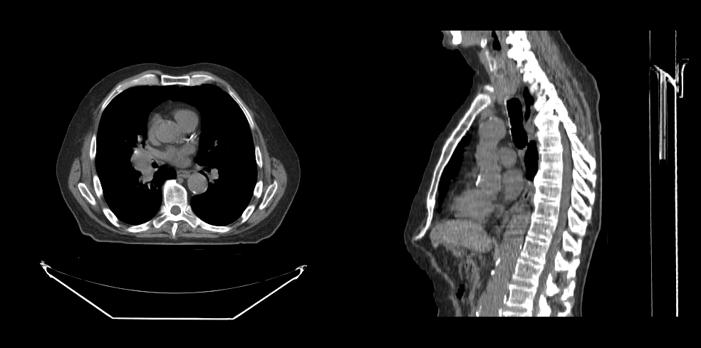

---

id: basic-volume
---

# 渲染体积

在本教程中，你将学习如何渲染一个体积。

## 前言

为了渲染一个体积，我们需要：

- 初始化 `cornerstone` 和相关库。
- HTMLDivElement 用于渲染体积的不同视角（例如，一个用于轴向视角，一个用于矢状面视角）。
- 图像的路径（`imageId`）。

## 实现步骤

### 第一步：初始化 `cornerstone` 和相关库

```js
import { init as coreInit } from '@cornerstonejs/core';
import { init as dicomImageLoaderInit } from '@cornerstonejs/dicom-image-loader';

await coreInit();
await dicomImageLoaderInit();
```

为了本教程，我们已经将图像存储在一个服务器上。

首先，我们创建两个 `HTMLDivElement` 并设置它们的样式，以容纳视口。

```js
const content = document.getElementById('content');

const viewportGrid = document.createElement('div');
viewportGrid.style.display = 'flex';
viewportGrid.style.flexDirection = 'row';

// 轴向视图元素
const element1 = document.createElement('div');
element1.style.width = '500px';
element1.style.height = '500px';

// 矢状面视图元素
const element2 = document.createElement('div');
element2.style.width = '500px';
element2.style.height = '500px';

viewportGrid.appendChild(element1);
viewportGrid.appendChild(element2);

content.appendChild(viewportGrid);
```

接下来，我们需要一个 `renderingEngine`（渲染引擎）。

```js
const renderingEngineId = 'myRenderingEngine';
const renderingEngine = new RenderingEngine(renderingEngineId);
```

通过使用 `volumeLoader` API 可以加载一个体积。

```js
const volumeId = 'myVolume';

// 在内存中定义一个体积
const volume = await volumeLoader.createAndCacheVolume(volumeId, { imageIds });
```

然后，我们可以使用 `setViewports` API 在渲染引擎中创建视口。

```js
const viewportId1 = 'CT_AXIAL';
const viewportId2 = 'CT_SAGITTAL';

const viewportInput = [
  {
    viewportId: viewportId1,
    element: element1,
    type: ViewportType.ORTHOGRAPHIC,
    defaultOptions: {
      orientation: Enums.OrientationAxis.AXIAL,
    },
  },
  {
    viewportId: viewportId2,
    element: element2,
    type: ViewportType.ORTHOGRAPHIC,
    defaultOptions: {
      orientation: Enums.OrientationAxis.SAGITTAL,
    },
  },
];

renderingEngine.setViewports(viewportInput);
```

`RenderingEngine` 将处理视口的创建。接下来，我们需要对体积执行 `load` 操作。

:::note 重要
定义一个体积并不等于加载它。
:::

```js
// 设置要加载的体积
volume.load();
```

最后，告知视口有关体积的信息。

```js
setVolumesForViewports(
  renderingEngine,
  [{ volumeId }],
  [viewportId1, viewportId2]
);

// 渲染图像
renderingEngine.renderViewports([viewportId1, viewportId2]);
```

## 完整代码

<details>
<summary>点击查看完整代码</summary>

```js
import {
  init as coreInit,
  RenderingEngine,
  Enums,
  volumeLoader,
  setVolumesForViewports,
} from '@cornerstonejs/core';
import { init as dicomImageLoaderInit } from '@cornerstonejs/dicom-image-loader';
import { createImageIdsAndCacheMetaData } from '../../../../utils/demo/helpers';

const { ViewportType } = Enums;

const content = document.getElementById('content');

const viewportGrid = document.createElement('div');
viewportGrid.style.display = 'flex';
viewportGrid.style.flexDirection = 'row';

// 轴向视图元素
const element1 = document.createElement('div');
element1.style.width = '500px';
element1.style.height = '500px';

// 矢状面视图元素
const element2 = document.createElement('div');
element2.style.width = '500px';
element2.style.height = '500px';

viewportGrid.appendChild(element1);
viewportGrid.appendChild(element2);

content.appendChild(viewportGrid);
// ============================= //

async function run() {
  await coreInit();
  await dicomImageLoaderInit();

  // 获取 Cornerstone 图像 ID 并将元数据加载到内存
  const imageIds = await createImageIdsAndCacheMetaData({
    StudyInstanceUID:
      '1.3.6.1.4.1.14519.5.2.1.7009.2403.334240657131972136850343327463',
    SeriesInstanceUID:
      '1.3.6.1.4.1.14519.5.2.1.7009.2403.226151125820845824875394858561',
    wadoRsRoot: 'https://d14fa38qiwhyfd.cloudfront.net/dicomweb',
  });

  // 实例化渲染引擎
  const renderingEngineId = 'myRenderingEngine';
  const renderingEngine = new RenderingEngine(renderingEngineId);

  const volumeId = 'myVolume';

  // 在内存中定义一个体积
  const volume = await volumeLoader.createAndCacheVolume(volumeId, {
    imageIds,
  });

  const viewportId1 = 'CT_AXIAL';
  const viewportId2 = 'CT_SAGITTAL';

  const viewportInput = [
    {
      viewportId: viewportId1,
      element: element1,
      type: ViewportType.ORTHOGRAPHIC,
      defaultOptions: {
        orientation: Enums.OrientationAxis.AXIAL,
      },
    },
    {
      viewportId: viewportId2,
      element: element2,
      type: ViewportType.ORTHOGRAPHIC,
      defaultOptions: {
        orientation: Enums.OrientationAxis.SAGITTAL,
      },
    },
  ];

  renderingEngine.setViewports(viewportInput);

  volume.load();

  setVolumesForViewports(
    renderingEngine,
    [{ volumeId }],
    [viewportId1, viewportId2]
  );
}

run();
```

</details>

你应该能看到：

<div style={{width:"75%"}}>



</div>

## 了解更多

了解更多内容：

- [体积](../concepts/cornerstone-core/volumes.md)
- [渲染引擎](../concepts/cornerstone-core/renderingEngine.md)
- [视口](../concepts/cornerstone-core/viewports.md)

有关 Volume Viewport 的高级用法，请访问 <a href="/live-examples/volumeAPI.html" target="_blank">VolumeViewport API</a> 示例页面。

:::note 提示

- 访问 [示例](../examples.md) 页面，了解如何在本地运行示例。

:::